Bu yazımızda Linux Deepin kurulumundan bahsedeceğiz. Öncelikle sisteminizin aşağıdaki **minimum** gereksinimleri karşıladığından emin olun.

**İşlemci:** Intel Pentium IV 2GHz

**Sistem belleği:** 2GB (4GB önerilir)

**Disk alanı:** 16GB (20GB önerilir)

Sisteminiz minimum gereksinimleri karşılıyor ise kurulum öncesi adımlarımıza geçebiliriz.

1. Başlangıç olarak en güncel kurulum imajına ihtiyacımız var. (Bu anlatım, bu yazı hazırlanırken en güncel sürüm olan 15.8'i temel almaktadır ancak kurulum adımları daha yeni sürümler için de geçerlidir. En güncel sürüme **İndir** menüsünü kullanarak ulaşabilirsiniz.)

2. İndirme tamamlandıktan sonra geriye, kurulum imajı ile önyüklenebilir USB bellek oluşturmak kalıyor. Bunun için de Windows'a erişimiz varsa [Rufus](https://rufus.ie/tr_TR.html) veya tüm platformlarda çalışan [Etcher](https://www.balena.io/etcher/) adlı uygulamayı kullanabilirsiniz. Daha geleneksel bir seçenek olan kurulum DVD'si oluşturma yoluna gitmek isterseniz, disk kalıbını boş bir DVD'ye yazdırmanız yeterli.

3. Bu aşamayı da tamamladıktan sonra, bilgisayarınızı yeni oluşturduğunuz USB Bellek/DVD ile başlatıp, kuruluma aşağıdaki adımlardan devam edebilirsiniz. Önyükleme medyasını seçmek için kullanmanız gereken tuş/tuş kombinasyonu, donanımınıza göre değişiklik gösterecektir. BIOS/EFI ekranına nasıl ulaşacağınızı bilmiyorsanız, bu anlamda en sık kullanılan tuşlar olan `Esc`, `Del`, `F2` veya `F12` tuşlarından birini deneyebilirsiniz! UEFI/EFI kurulumu yapacaksanız, önyükleme medyası seçenekleri arasından Linux Deepin UEFI veya benzeri seçeneği seçtiğinizden emin olun.

## Kurulum

### Adım 1: Boot menüsü

Bu ilk ekranda, kuruluma devam etmek için `Install Deepin` seçeneğini, işletim sistemini kurmadan denemek için `Deepin Failsafe` seçeneğini kullanabilirsiniz. Ayrıca, kurulum medyasının bütünlüğünü doğrulamak için `Check iso md5sum` seçeneğine de erişimimiz var. Dosyanın bütünlüğünden emin değilseniz veya emin olmak istiyorsanız bu seçeneği kullanabilirsiniz. Kuruluma geçmek için `Install Deepin` ile devam ediyoruz.

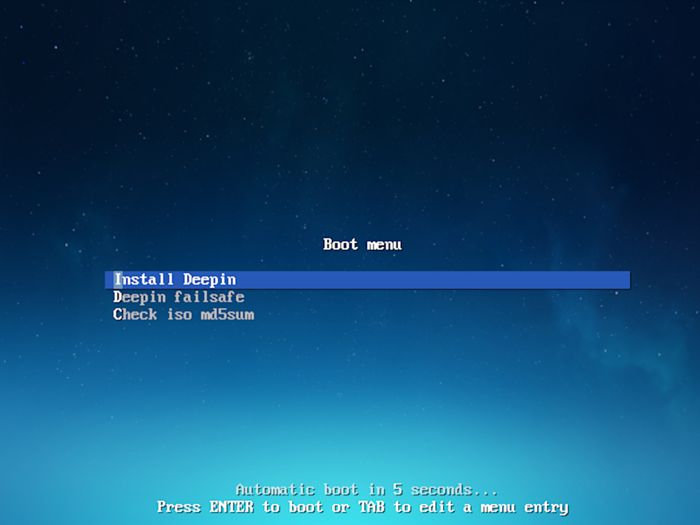

### Adım 2: Sistem dili seçimi

Bu adımda kurulum dilini seçiyoruz. Ben `Türkçe`yi işaretleyip, `Sonraki` ile devam ettim. Sistem dilini kurulumdan sonra değiştirmek de mümkün.

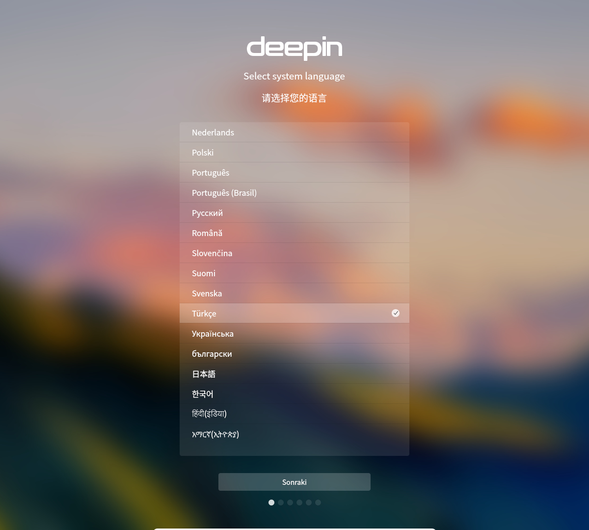

### Adım 3: Lisans Sözleşmesi

Bu adımda, kurulum aşamasına yeni eklenmiş olan **Son Kullanıcı Lisans Sözleşmesi**ni okuyup onaylıyoruz. Sözleşmeyi onaylamazsanız kuruluma devam edemeyeceğinizi hatırlatmakta fayda var.

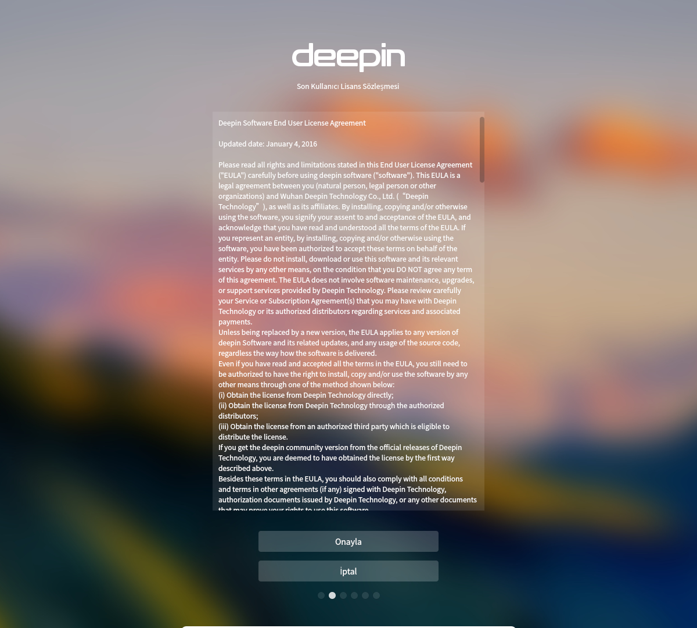

### Adım 4: Kullanıcı hesabı oluşturma

Bu adımda, kullanıcı ve bilgisayar bilgilerimizi girerek yeni bir kullanıcı oluşturuyoruz. Aynı zamanda sol üst köşedeki buton yardımıyla **klavye düzeni** ayarını yapmayı da unutmayın!

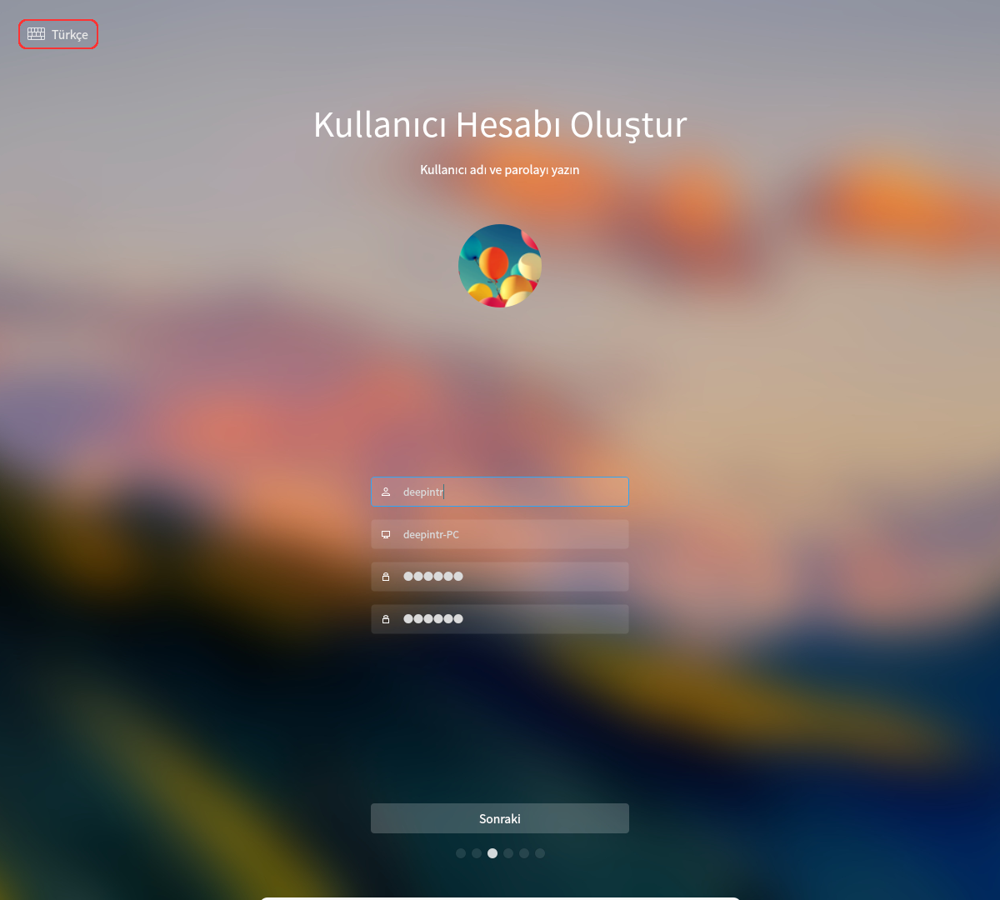

### Adım 5: Saat dilimi

Bu adımda saat dilimini seçiyoruz. Halihazırda seçili olan saat dilimi konumunuzu yansıtmıyorsa, dünya haritası üzerinde ilgili konuma tıklayarak saat diliminizi seçebilirsiniz.

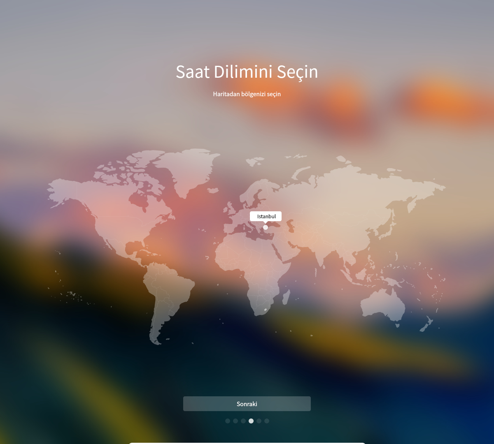

### Adım 6: Disk yapılandırması

Kurulumun belki de açıklama gerektiren tek aşaması olan bu adımda, Deepin'in diski nasıl kullanacağına karar veriyoruz. Toplamda 3 seçeneğimiz bulunuyor: `Basit`, `Gelişmiş` ve `Tüm Disk`. Şimdi tek tek seçenekleri inceleyelim.

**Basit:**

Basit seçeneği, diskinizdeki tüm bölümleri listeliyor ve içlerinden birini seçmenize izin veriyor. Ben sanal makine üzerinde kurulum yaptığım ve temiz bir sanal disk bağladığım için, tüm diski yansıtan tek bir seçenek görünüyor. Basit seçeneği ile devam etmek isterseniz, diskinizdeki boş alanlardan birini seçerek devam edebilirsiniz. **Dual boot** yapmak isteyen kullanıcılar, kurulumdan önce Windows içerisinden disklerinde boş bir bölüm oluşturabilir, ve kurulum esnasında bu ekrandan ilgili bölümü seçerek devam edebilirler. Bu mod ile ilgili bilmeniz gereken bir diğer husus ise, seçtiğiniz bölümün, `ext4` türünde biçimlendirilip, Deepin'i kurabilmek için zorunlu olan tek bağlama noktası olan `/` konumuna bağlanmasıdır.

**Gelişmiş:**

İsminden de anlaşılabileceği gibi bu modda disk yapılandırmasına dilediğiniz gibi müdahale edebiliyorsunuz. Yeni bölümler eklemek, var olanları silmek, takas alanı oluşturmak yapabileceğiniz işlemler arasında. Bu yüzden dikkatli olmanızda fayda var. Yine **dual boot** yapmak isteyen kullanıcılar, Windows bölümüne dokunmadan Deepin için yeni bir bölüm oluşturup kuruluma devam edebilirler.

Ben bu durumda, görselde görebileceğiniz üzere, sistemi kurmak için root `/` bölümü ve `takas bölümü` oluşturdum. Yapılandırmaları ise şu şekilde:

**Kurulum bölümü:** Bağlama noktası: `/` - Dosya sistemi: `ext4`

**Takas bölümü:** Bağlama noktası: `(Otomatik, seçmenize gerek yok)` - Dosya sistemi: `Takas bölümü`

Takas bölümü zorunlu olmamasına rağmen, sistem belleğinin düşük olduğu durumlarda kullanılmasında fayda var. Takas bölümü boyutu için kabul gören genel yaklaşım ise, en az sistem belleği boyutu veya sistem belleğinin iki katıdır. Sanal makine için 4GB ram ayırdığımdan, 4GB'lık takas bölümü oluşturmayı uygun gördüm ben.

Not: Eğer `UEFI/EFI` kurulum yapıyorsanız ve disk yapılandırmanız için gelişmiş modu kullanıyorsanız, bu aşamada `en az 300 MB` (512 MB önerilir) boyutunda bir `efi` bölümü oluşturmanız gerekiyor. Basit ve Tüm Disk modlarında ise bu işlem otomatik olarak gerçekleşiyor, yani ekstra birşey yapmanıza gerek yok. Bu durumda ben BIOS kurulumu yaptığım için efi bölümü oluşturmuyorum.

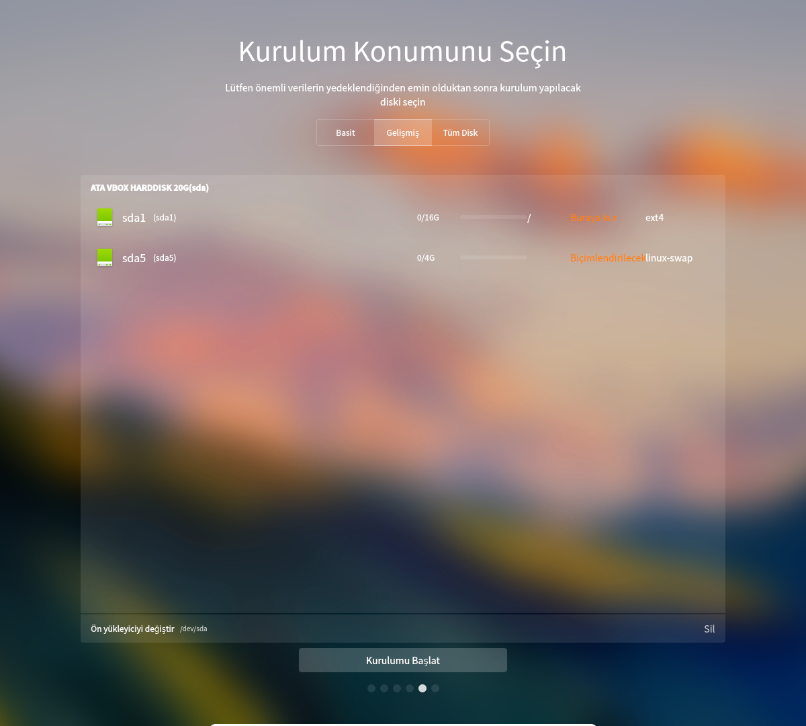

**Tüm disk:**

Bu modda Deepin'e diski nasıl kullanacağı konusunda **tam yetki vermiş oluyorsunuz!** Bu modu seçerek kuruluma devam ederseniz eğer, **diskiniz tamamen biçimlendirilecek ve sadece Deepin kurmak/kullanmak üzere yapılandırılacaktır**. Bu yüzden ekstra dikkatli olmanız tavsiye edilir. Tüm disk seçeneği ile devam etmeniz halinde Deepin, öncelikle sistemi kurmak için `/` bölümü, kullanıcı dosyaları için `/home` bölümü ve üçüncü parti uygulamalar/paketler için `/opt` bölümü oluşturacaktır. Bu yapılandırmanın avantajı, daha sonra format atmanız gerektiğinde sadece `/` bölümüne temiz kurulum yaparak, kullanıcı dosyalarınız ve uygulamalarınızda değişiklik olmadan kaldığınız yerden devam edebilmenizdir. Ki aynı şeyi, gelişmiş seçeneğini kullanarak yapmanız da mümkün.

Tüm disk modunun sunduğu diğer bir seçenek de **disk şifreleme**. Ekranın alt kısmında görünen **Diskin Tamamını Şifrele** seçeneğini onaylarsanız, bir sonraki ekranda diskiniz için bir parola oluşturmanız istenecek. Disk şifreleme özelliğini kullanacaksanız, oluşturduğunuz bu parolayı güvenli bir yerde saklamanızda fayda var, zira oturum açmak dahil olmak üzere disk erişimi gerektiren her işlem için bu parolayı kullanmanız gerekecek! (Tam disk şifreleme hakkında detaylı bilgi için [şu](https://mertcangokgoz.com/tam-disk-sifrelemesi-nedir/) makaleye göz atabilirsiniz.)

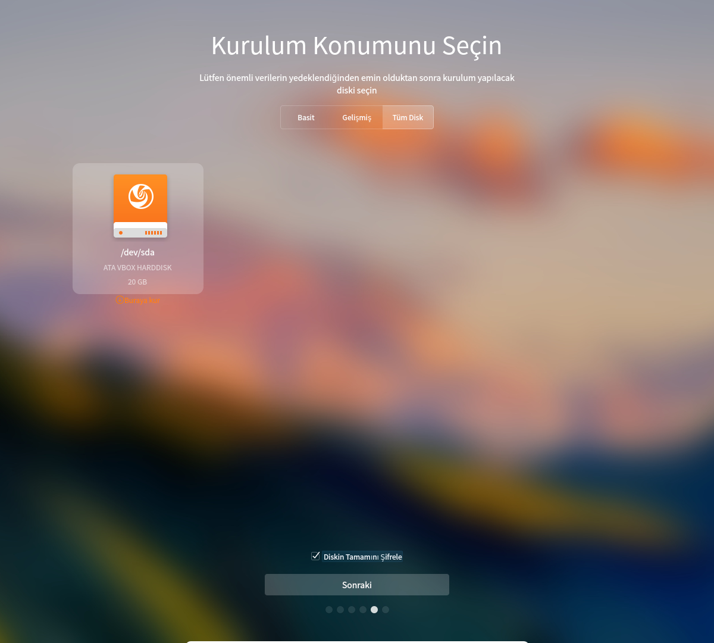

Disk yapılandırması seçeneklerini inceledikten sonra ben kuruluma `Gelişmiş` modda, yukarıda anlattığım konfigürasyon ile devam ediyorum: `/` (root) bölümü ve `takas bölümü`.

Disk yapılandırmanıza karar verip, `Sonraki` butonuna tıkladığınızda aşağıdaki ekran ile karşılaşıyorsunuz. Bu aşamada Deepin, yapmak üzere olduğu değişiklikler konusunda sizi son bir defa bilgilendiriyor. Herşeyin iyi göründüğünden eminseniz `Devam Et` seçeneği ile kuruluma geçebilir veya disk yapılandırmanızı düzenlemek için `Geri` butonuna tıklayabilirsiniz.

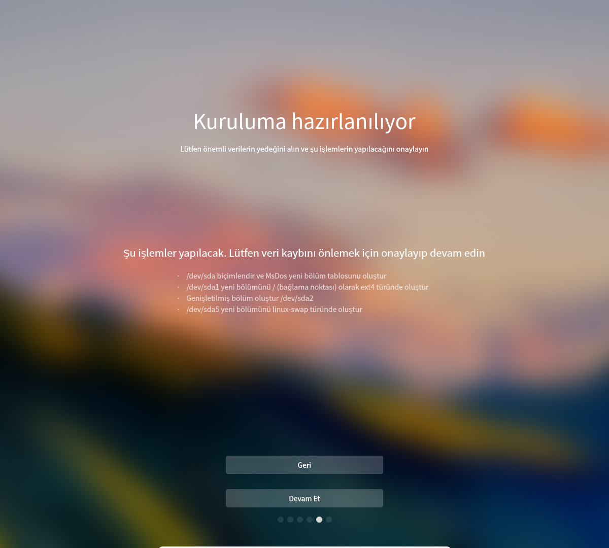

### Adım 7: Kurulum

Bu adımda kuruluma başlamış bulunuyoruz. Sistem yapılandırmanıza bağlı olarak kurulum, 15-20 dakika arasında tamamlanmakta.

### Adım 8: Yeniden başlatma

Kurulum tamamlandığında aşağıdaki ekran ile karşılaşıyoruz. Basitçe, kurulum medyasını (USB bellek) çıkarıp, `Şimdi Deneyimleyin` butonu ile devam ediyoruz.

### Adım 9: Grub ile tanışın!

Kurulum tamamlanıp sisteminiz yeniden başlatıldıktan sonra, Deepin'le (ve diğer birçok dağıtımla) birlikte gelen önyükleyici olan `Grub` ile karşılaşıyoruz. Listeden `Deepin GNU/Linux`u seçerek devam ediyoruz.

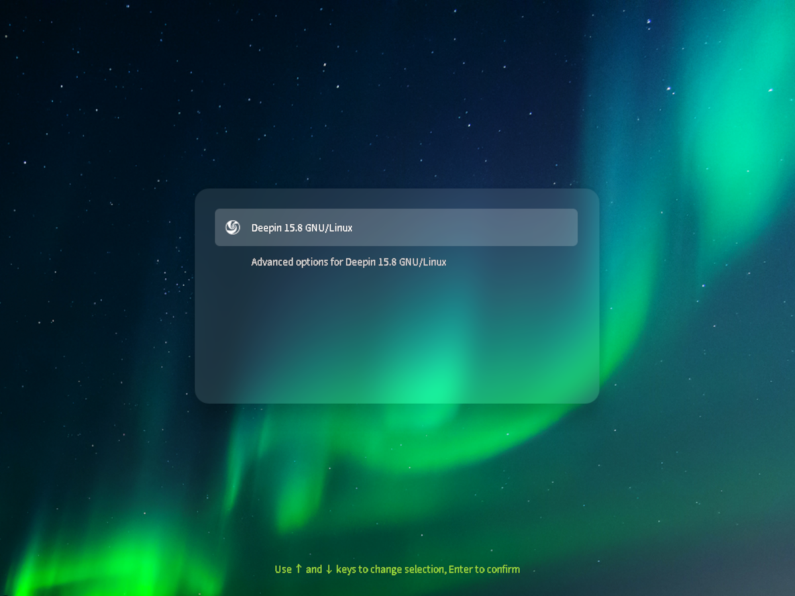

### Adım 10: Oturum açma

Bu ekranda Deepin'de ilk defa oturum açmak için, kurulum aşamasında belirlediğimiz parolamızı girip Enter'a basıyoruz.

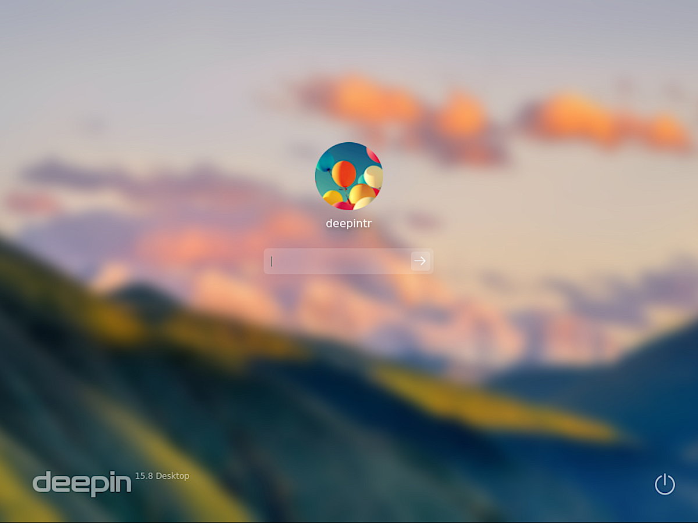

### Final: Tebrikler! Kurulumu başarıyla tamamladınız.

İlk defa oturum açtığınızda, aşağıdaki gibi bir hızlı yapılandırma ekranı ile karşılaşıyorsunuz. Bu yardımcı uygulama ile tema, pencere etkileri, simge teması gibi özelleştirme ayarlarını yaptıktan sonra, Deepin keyfini yaşamaya başlayabilirsiniz! Ayrıca -varsa- sistem güncellemelerini yüklemenizde de fayda var.

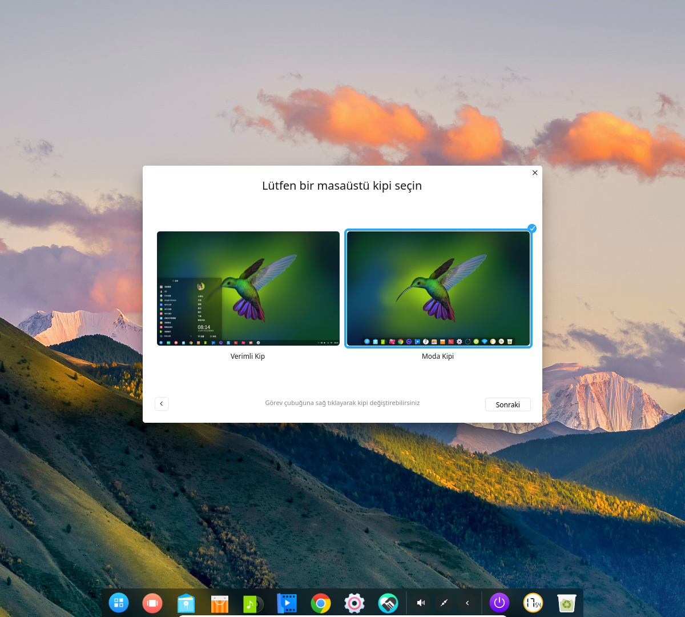
